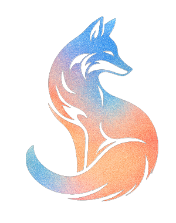

# Cryptic Fox — Cryptography Toolkit

**Cryptic Fox** is a comprehensive, web-based suite of tools and educational resources designed for cryptography enthusiasts, puzzle solvers, and cybersecurity students. It provides a professional environment to encrypt, decrypt, and analyze hidden information across various media formats.

## 🦊 Features

### 🔐 Cryptography Suite
- **Multi-Cipher Support**: Easily encrypt and decrypt messages using classic algorithms including Caesar, Vigenère, Atbash, Rail Fence, and more.
- **TEP Cipher Translator**: A specialized translator for the unique TEP cipher system.
- **Image Encryption**: Secure image data using Base64 encoding/decoding utilities.
- **Audio Encryption**: Protect audio assets with robust AES and RSA encryption implementations.

### 🔍 Steganalysis & Digital Forensics
- **Video Steganalysis (RED)**: A powerful tool for extracting hidden payloads from video files using LSB (Least Significant Bit) analysis, color manipulation, and frame-by-frame inspection.
- **Steganography Hunts**: Interactive "Phantom Pixels" challenges designed to test your ability to find information hidden in plain sight.

### 🧠 Knowledge & Resources
- **Educational Blog**: Deep dives into the evolution of secrecy, from ancient hieroglyphs to modern digital mysteries like Cicada 3301, S.V.V., and The END Project.
- **Curated Resources**: A collection of high-quality courses, external tools, and research materials to further your cryptographic education.
- **Interactive Puzzles**: A growing library of logic challenges and cryptographic riddles.

## 🛠️ Technology Stack
- **Core**: Vanilla HTML5, CSS3, and JavaScript (ES6+).
- **Architecture**: Static site architecture for maximum performance and security.
- **Data Management**: XML-based system for dynamic blog post indexing and metadata.
- **Design**: Premium, dark-mode aesthetic with custom CSS micro-animations and responsive layouts.

## 📂 Project Structure
- Repository Root: Core application pages (Home, About, Tools, Resources).
- `blog-posts/`: In-depth articles and dossiers on cryptographic history and mysteries.
- `js/`: Modular JavaScript logic for encryption algorithms and UI interactions.
- `images/`: High-resolution assets and AI-generated thematic imagery.
- `xml/`: Metadata and sitemaps for content management.
- `style.css`: Centralized design system and styling tokens.

## 🤝 Support & Sponsorship
Cryptic Fox is an independent project. You can support the development of new tools and blog posts via:
- **Ko-fi**: [Support me on Ko-fi](https://ko-fi.com/S6S81YLIDM)
---
*© 2026 Cryptic Fox | Secrecy is an Art.*
